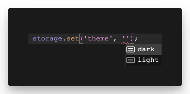

<p align="center">
  
</p>

<h1 align="center">L-Storage</h1>

<p align="center">
  A type-safe wrapper around the browser's localStorage API using Zod for runtime validation and TypeScript type inference.
</p>

<p align="center">
  <a href="https://www.npmjs.com/package/@marcelrsoub/l-storage"></a>
  <a href="https://github.com/marcelrsoub/l-storage/blob/main/LICENSE"></a>
  
</p>

## Features

<p align="center">
  
</p>


- Type-safe get/set operations using Zod schemas
- Complete access to all native localStorage methods
- Automatic key tracking and management
- TypeScript type inference for stored values
- Runtime validation using Zod
- Configurable key prefixing
- Strict/lenient validation modes

## Installation

<details>
<summary>npm</summary>

```bash
npm install @marcelrsoub/l-storage zod
```
</details>

<details>
<summary>pnpm</summary>

```bash
pnpm add @marcelrsoub/l-storage zod
```
</details>

<details>
<summary>yarn</summary>

```bash
yarn add @marcelrsoub/l-storage zod
```
</details>

<details>
<summary>bun</summary>

```bash
bun add @marcelrsoub/l-storage zod
```
</details>

> **Note:** Zod is a peer dependency and must be installed alongside l-storage.

## Usage

```typescript
import { createTypedStorage } from '@marcelrsoub/l-storage';
import { z } from 'zod';

// Define your storage schema
const storage = createTypedStorage({
  user: z.object({
    name: z.string(),
    age: z.number()
  }),
  theme: z.enum(['light', 'dark']),
  settings: z.record(z.any())
}, {
  prefix: 'app', // optional prefix for all keys
  strict: true   // throw on validation errors
});

// Type-safe operations
storage.set('user', { name: 'John', age: 30 }); // ✅ Valid
storage.set('user', { name: 'John' }); // ❌ TypeScript error
storage.set('theme', 'light'); // ✅ Valid
storage.set('theme', 'blue'); // ❌ TypeScript error

// Get values with correct types
const user = storage.get('user'); // type: { name: string, age: number } | null
const theme = storage.get('theme'); // type: 'light' | 'dark' | null

// Manage keys
storage.remove('user');
storage.clear();
const keys = storage.getRegisteredKeys();
const hasUser = storage.has('user');
```

### Default Values

You can specify default values using Zod's `.default()` method:

```typescript
const storage = createTypedStorage({
  theme: z.enum(['light', 'dark']).default('light'),
  user: z.object({
    name: z.string(),
    age: z.number()
  }).default({ name: 'Guest', age: 0 })
});

// Now get() will return the default instead of null when key doesn't exist
const theme = storage.get('theme'); // 'light' instead of null if not set
const user = storage.get('user');   // { name: 'Guest', age: 0 } instead of null if not set
```

## API Reference

### `createTypedStorage(schemas, options?)`

Creates a new typed storage instance.

#### Parameters

- `schemas`: Record of Zod schemas defining the structure of stored data
- `options`: (optional) Configuration options
  - `prefix`: String prefix for all storage keys
  - `strict`: Whether to throw on validation errors (default: true)

#### Methods

- `get(key)`: Get a value by key (returns the default value if schema has one, otherwise null)
- `set(key, value)`: Set a value for a key
- `remove(key)`: Remove a value by key
- `clear()`: Clear all registered keys
- `getRegisteredKeys()`: Get array of all registered keys
- `has(key)`: Check if a key exists

## Error Handling

In strict mode (default), the library throws typed errors for:
- Invalid data validation
- JSON parsing failures
- Storage quota exceeded

Each error includes:
- `key`: The storage key that caused the error
- `value`: The value that failed
- `type`: Error type ('validation' | 'parsing' | 'storage')

## Contributing

Contributions are welcome! Please feel free to submit a Pull Request.

1. Fork the repository
2. Create your feature branch (`git checkout -b feature/amazing-feature`)
3. Commit your changes (`git commit -m 'Add some amazing feature'`)
4. Push to the branch (`git push origin feature/amazing-feature`)
5. Open a Pull Request

## License

[MIT](LICENSE) © Marcel Soubkovsky